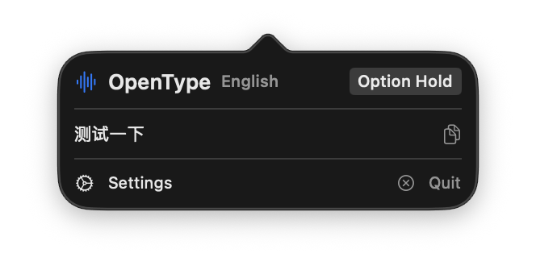

<div align="center">

# OpenType

**macOS 菜单栏本地 AI 语音输入**

---

[](https://github.com/IchenDEV/opentype/stargazers)
[](https://github.com/IchenDEV/opentype/network/members)
[](https://github.com/IchenDEV/opentype/issues)
[](https://github.com/trending/swift)

[](https://www.apple.com/macos/)
[](https://swift.org)
[](https://www.apple.com/mac/m1/)
[](LICENSE)

[](https://github.com/IchenDEV/opentype)
[](https://github.com/IchenDEV/opentype)
[](https://github.com/argmaxinc/WhisperKit)
[](https://github.com/ml-explore/mlx-swift-lm)

[English](README.md)

</div>

---

## 项目简介

**OpenType** 是一款 macOS 菜单栏语音输入应用，完全本地运行，初次下载模型后无需联网。按住快捷键开始录音，松开后自动转写，结果直接输入到当前激活的应用中。

支持两种工作模式：

- **直出模式** — Whisper 原始转写，延迟极低
- **LLM 整理模式** — 由本地 Qwen3 模型润色，去语气词、修正口误、统一格式

## 截图



*菜单栏弹窗 — 展示上次转写结果，支持一键复制、语言切换和快捷键模式选择。*

## 功能特性

| 功能 | 说明 |
|---|---|
| **离线语音识别** | WhisperKit 驱动，完全本地运行 |
| **智能文字整理** | MLX + Qwen3-0.6B 4-bit，去语气词、修正口误、结构化排版 |
| **全局快捷键** | 长按 Fn 激活（支持 Ctrl/Shift/Option/Fn，可配置长按、双击、单击） |
| **屏幕上下文** | 截取屏幕文字，辅助 LLM 纠正同音字（需屏幕录制权限） |
| **麦克风选择** | 支持选择任意音频输入设备 |
| **音效反馈** | 开始/停止录音时播放提示音 |
| **个人词库** | 自定义词汇替换规则和 LLM 编辑规则 |
| **语言风格** | 简洁精炼 / 正式书面 / 日常口语 / 自定义提示词 |

## 系统要求

- **系统**：macOS 26 (Tahoe) 或更高版本
- **芯片**：Apple Silicon（M1 / M2 / M3 / M4）
- **空间**：约 2GB（Whisper 模型 ~1.5GB + Qwen3 模型 ~335MB）

## 构建与运行

```bash
# 编译（Release）
swift build -c release

# 运行
swift run OpenType

# 或在 Xcode 中打开
open Package.swift
# 选择 OpenType scheme → Release 配置 → 运行（⌘R）
```

## 首次使用

1. 点击菜单栏中的麦克风图标
2. 前往**设置 → 权限**，授予麦克风和辅助功能权限
3. 等待 Whisper 模型下载完成（首次约 1.5GB）
4. 长按 **Fn** 键开始语音输入，松开后文字自动插入当前位置

## 权限说明

| 权限 | 用途 | 必需 |
|---|---|---|
| 麦克风 | 语音采集 | 是 |
| 辅助功能 | 全局快捷键 + 文本注入（模拟 ⌘V） | 是 |
| 语音识别 | Apple 语音识别引擎（可选引擎） | 否 |
| 屏幕录制 | 截取屏幕文字辅助纠错 | 否 |
| 网络 | 首次下载 Whisper 和 LLM 模型 | 仅首次 |

## 项目结构

```
Sources/
├── App/          # 应用入口、AppDelegate、状态管理、语音管道
├── Audio/        # 麦克风录音、音效播放
├── Config/       # 用户设置（UserDefaults）、模型目录
├── Hotkey/       # 全局快捷键（CGEvent tap）
├── LLM/          # MLX-LM 推理引擎、提示词构建
├── Output/       # 文本注入（剪贴板 + 模拟粘贴）
├── Processing/   # 文本清理、个人词库
├── Screen/       # 屏幕 OCR（ScreenCaptureKit + Vision）
├── Speech/       # 语音识别协议、WhisperKit、Apple Speech
└── UI/           # SwiftUI 菜单栏、设置面板、浮动 HUD
```

## 技术栈

- [WhisperKit](https://github.com/argmaxinc/WhisperKit) — 离线 Whisper 语音识别
- [mlx-swift-lm](https://github.com/ml-explore/mlx-swift-lm) — Apple Silicon 本地 LLM 推理
- **SwiftUI + AppKit** — macOS 原生 UI 框架
- **ScreenCaptureKit + Vision** — 屏幕 OCR
- **AVAudioEngine** — 低延迟麦克风采集

---

<div align="center">

专为 Apple Silicon 打造

</div>
